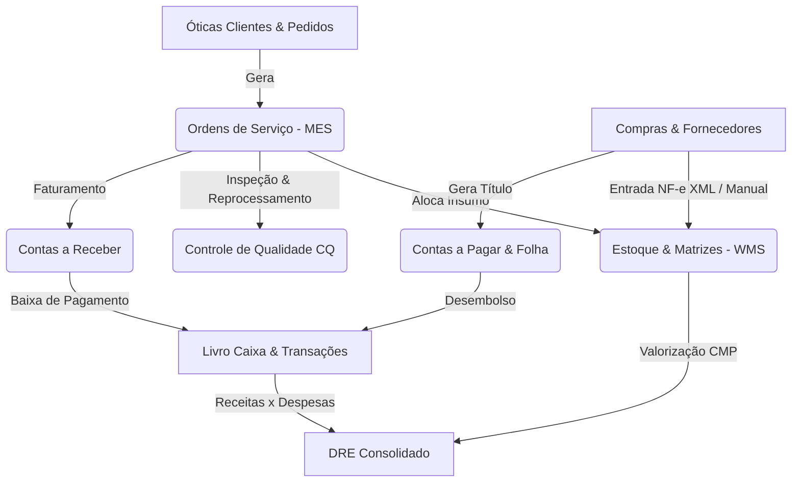

# 📊 Relatório Arquitetural & Funcional do Sistema LeoÓtica
**Documento de Especificação Técnica para Criação do Módulo / Aba de Relatórios**

* **Sistema:** LeoÓtica — Solução ERP/MES/WMS para Laboratórios Óticos Industriais
* **Versão:** 2.0 Enterprise
* **Stack Tecnológica:**
  * **Backend:** Python 3.12, FastAPI (Assíncrono), SQLAlchemy 2.0 (Async), SQLite / PostgreSQL
  * **Frontend:** React 18, Vite, CSS Vanilla Moderno, Lucide Icons, Axios
  * **Motor de Cálculos:** Custo Médio Ponderado (CMP), DRE Real-time, Alocação Atômica Multimatriz, Transposição Clínica de Dioptrias, Motor Preditivo de Reposição

---

## 1. Visão Geral e Arquitetura do Sistema

O **LeoÓtica** é uma plataforma integrada de gestão fabril e comercial projetada para controlar todo o ciclo de vida de um laboratório óptico:
1. **Entrada de Pedidos:** Recepção de receitas (via IA OCR, Bipagem USB ou Digitação) e validação de crédito/inadimplência da ótica cliente.
2. **Triagem & Geometria:** Validação do diâmetro físico da lente vs medidas da armação (A, B, DBL, ED) e transposição clínica de grau cilíndrico (+ para -).
3. **Alocação de Estoque Multimatriz:** Separação atômica de insumos em 5 matrizes ópticas (`LP_GRADE`, `GRADE_167`, `MF_ACB`, `MF_BLOCO`, `BLOCO_VS`).
4. **Chão de Fábrica (MES):** Roteamento automático entre esteira *Expressa Facetamento* e *Surfaçagem Digital CNC*, com rastreabilidade por código de barras de bandeja (`tray_number`), estações de trabalho e Controle de Qualidade (CQ).
5. **Faturamento & Financeiro:** Fechamentos periódicos por loja, Contas a Receber/Pagar, Livro Caixa e DRE em tempo real valorizado pelo CMP.

---

## 2. Mapa Completo de Módulos e Entidades de Dados

Abaixo estão listadas todas as entidades do banco de dados e fluxos operacionais que alimentarão os relatórios:

---

## 3. Módulos Funcionais e Especificação de Relatórios Propostos

### 3.1. Módulo de Produção & Chão de Fábrica (MES)
* **Entidades Envolvidas:** `service_orders`, `os_workflow_history`, `cq_inspections`, `service_order_items`.
* **Métricas Existentes:** Quantidade de OSs recebidas, em produção, em surfaçagem, em facetamento, montagem, concluídas, canceladas e bloqueadas financeiramente; tempos de permanência por estação.

#### 📋 Relatórios Propostos para este Módulo:
1. **Relatório Analítico de Ordens de Serviço (Geral):**
   * *Filtros:* Período (Data Inicial/Final), Status da OS, Ótica Cliente, Rota de Produção (Expressa vs CNC), Prioridade (Normal, Urgente, Refazimento).
   * *Colunas:* Nº OS, Data Entrada, Pedido Loja, Ótica, Bandeja, Tipo (Padrão/Reparo), Grau OD/OE, Rota, Status Atual, Valor Total (R$), Data Conclusão.
   * *Totalizadores:* Qtd Total de OSs, Valor Total Faturado, Tempo Médio de Entrega (Lead Time em Horas).

2. **Relatório de Eficiência e Produtividade da Esteira (Gargalos & Lead Time):**
   * *Filtros:* Período, Setor da Fábrica (Separação, Surfaçagem, Tratamento, Facetamento, Montagem, CQ, Expedição).
   * *Colunas:* Setor, Qtd Processada, Tempo Médio de Ciclo (horas/minutos), Tempo Máximo em Espera, Operador Responsável.

3. **Relatório de Quebra, Refugo e Não-Conformidade (Controle de Qualidade):**
   * *Filtros:* Período, Tipo de Falha (Grau Incorreto, Risco na Lente, Eixo Fora, Lasca, Descentralização), Inspetor CQ.
   * *Colunas:* Nº OS, Data Inspeção, Lente/Bloco Utilizado, Motivo da Reprovação, Ação Tomada (Retrabalho / Descarte), Custo do Insumo Perdido (CMP).
   * *KPI:* Taxa de Quebra Geral (%).

---

### 3.2. Módulo de Estoque, Compras & WMS (Valorizado por CMP)
* **Entidades Envolvidas:** `lens_models`, `lens_inventory_grade`, `stock_movements`, `supplier_orders`, `supplier_order_items`.
* **Métricas Existentes:** Saldo disponível, saldo reservado, localização física (gaveta/prateleira), Custo Médio Ponderado (`average_cost_price`), Último Preço de Compra (`last_purchase_price`), Ponto de Reposição e Consumo Histórico.

#### 📋 Relatórios Propostos para este Módulo:
1. **Posição Geral de Estoque Físico e Financeiro (Kardex Valorizado):**
   * *Filtros:* Matriz (`LP_GRADE`, `GRADE_167`, `MF_ACB`, `MF_BLOCO`, `BLOCO_VS`), Marca, Tratamento, Índice de Refração.
   * *Colunas:* Código/EAN, Modelo, Tratamento, Dioptria (Esf/Cil/Add/Base), Localização (Gaveta), Saldo Físico, Saldo Reservado, Saldo Livre, CMP Unitário (R$), Valor Total em Estoque (R$).
   * *Totalizadores:* Volume Total de Peças, Patrimônio Total em Estoque (R$).

2. **Relatório de Ruptura e Reposição Urgente (Estoque Crítico):**
   * *Filtros:* Nível de Estoque ($\le 2$ un, Zerado, Abaixo do Ponto de Pedido).
   * *Colunas:* Matriz, Descrição, Dioptria/Base, Saldo Atual, Média de Consumo Diário, Dias de Cobertura Restantes, Sugestão de Compra (Qtd).

3. **Relatório de Movimentações de Estoque (Extrato Kardex):**
   * *Filtros:* Período, Tipo de Movimento (`IN` - Entrada, `OUT` - Saída OS, `AUDIT` - Ajuste Inventário), Modelo de Lente.
   * *Colunas:* Data/Hora, Tipo, Quantidade, Saldo Anterior, Saldo Resultante, Motivo/Referência (Nº OS ou NF Fornecedor), Operador.

4. **Curva ABC de Lentes e Consumo de Insumos:**
   * *Filtros:* Período de Análise (30, 60, 90 dias).
   * *Colunas:* Classificação (Curva A, B, C), Modelo da Lente, Qtd Consumida, Frequência de Giro, Custo Total Consumido.

---

### 3.3. Módulo Comercial & Vendas
* **Entidades Envolvidas:** `optical_stores`, `commercial_orders`, `products`, `technical_services`.
* **Métricas Existentes:** Faturamento bruto por loja, ticket médio, tabelas por grau, descontos e overrides manuais com justificativa.

#### 📋 Relatórios Propostos para este Módulo:
1. **Relatório de Faturamento e Volume por Ótica Cliente:**
   * *Filtros:* Período, Ótica (Loja), Faixa de Faturamento.
   * *Colunas:* CNPJ/Razão Social, Nome Fantasia, Qtd de OSs Entregues, Valor Total Faturado, Ticket Médio por OS, Prazo Médio de Pagamento, Status Financeiro Atual.
   * *Gráfico:* Top 10 Clientes em Faturamento.

2. **Relatório de Vendas por Família de Produtos & Tratamentos:**
   * *Filtros:* Período, Tipo de Insumo (Lentes Acabadas, Blocos Surfaçados, Multifocais, Tratamentos AR, Fotossensíveis, Azul).
   * *Colunas:* Categoria, Nome Comercial, Qtd Vendida, Preço Médio Praticado, Faturamento Bruto, Participação no Faturamento (%).

3. **Relatório de Serviços Técnicos Laboratoriais:**
   * *Filtros:* Período, Tipo de Serviço (Montagem Balgriff, Coloração Solar, Bisel Especial, Ajuste).
   * *Colunas:* Nome do Serviço, Qtd Executada, Valor Total Arrecadado.

4. **Relatório de Auditoria de Descontos e Preços Manuais (*Price Overrides*):**
   * *Filtros:* Período, Apenas OSs com preço alterado manualmente.
   * *Colunas:* Nº OS, Ótica, Valor de Tabela, Valor Praticado, Diferença (R$), Justificativa Registrada, Operador que Aplicou.

---

### 3.4. Módulo Financeiro Corporativo, Contas & DRE
* **Entidades Envolvidas:** `accounts_receivable`, `accounts_payable`, `financial_transactions`, `optical_stores`.
* **Métricas Existentes:** Faturas em aberto/atrasadas/liquidadas, aging list de atraso (dias de vencimento), contas a pagar por centro de custo/fornecedor, folha de pagamento, Livro Caixa e DRE gerencial.

#### 📋 Relatórios Propostos para este Módulo:
1. **DRE Gerencial Consolidado (Demonstração do Resultado do Exercício):**
   * *Filtros:* Mês de Competência / Período Customizado.
   * *Estrutura Exibida:*
     * (+) **Receita Bruta Operacional** (Vendas de Lentes + Serviços)
     * (-) **Deduções / Descontos Concedidos**
     * (=) **Receita Líquida**
     * (-) **CMV Real - Custo das Mercadorias Vendidas** (Baixas físicas ao CMP)
     * (=) **Lucro Bruto / Margem Bruta** (R$ e %)
     * (-) **Despesas Operacionais & Utilidades** (Contas a Pagar liquidadas)
     * (-) **Folha de Pagamento & Encargos**
     * (=) **Resultado Operacional Líquido** (R$ e Margem Líquida %)

2. **Aging List & Relatório de Inadimplência (Contas a Receber):**
   * *Filtros:* Status (Pendente, Atrasado, Parcial, Liquidado), Faixa de Atraso (A Vencer, 1-15 dias, 16-30 dias, 31-60 dias, 60+ dias).
   * *Colunas:* Ótica Cliente, Nº Fatura/Documento, Data Emissão, Data Vencimento, Dias de Atraso, Valor Original, Valor Pago, Saldo Devedor.
   * *Totalizadores:* Total a Receber Vencido vs A Vencer.

3. **Fluxo de Caixa Realizado vs Projetado:**
   * *Filtros:* Período (Visão Diária ou Semanal).
   * *Colunas:* Data, Entradas Previstas, Entradas Realizadas, Saídas Previstas (Contas a Pagar/Folha), Saídas Realizadas, Saldo Líquido do Dia, Saldo Acumulado em Caixa.

4. **Extrato Detalhado do Livro Caixa (`financial_transactions`):**
   * *Filtros:* Período, Tipo (RECEITA / DESPESA), Forma de Pagamento (PIX, Boleto, Cartão, Transferência).
   * *Colunas:* Data/Hora, Identificador, Categoria, Descrição/Histórico, Tipo (+/-), Valor (R$), Saldo em Conta.

---

## 4. Requisitos Técnicos e Arquitetura da Nova Aba de Relatórios

Para o Engenheiro de Software implementar a **Aba de Relatórios**, recomenda-se a seguinte estrutura:

### 4.1. Estrutura de Rotas no Backend (`/api/v1/reports/`)
Criar um novo router em `backend/app/api/endpoints/reports.py`:
* `GET /api/v1/reports/os/analytic` ➔ Retorna lista paginada e totalizada de OSs para exportação.
* `GET /api/v1/reports/production/kpis` ➔ Métricas de lead time e quebras por setor.
* `GET /api/v1/reports/inventory/position` ➔ Posição completa de estoque valorizada pelo CMP.
* `GET /api/v1/reports/inventory/movements` ➔ Histórico analítico de entradas e saídas.
* `GET /api/v1/reports/financial/dre` ➔ DRE consolidado por período.
* `GET /api/v1/reports/financial/aging` ➔ Relatório de contas a receber com faixas de vencimento.
* `GET /api/v1/reports/commercial/customer-ranking` ➔ Ranking de faturamento por ótica.
* `GET /api/v1/reports/export/excel` & `GET /api/v1/reports/export/pdf` ➔ Endpoints geradores de arquivos binários prontos para download.

### 4.2. Estrutura Visual no Frontend (`RelatoriosHub.jsx`)
Adicionar a nova aba no menu principal do `App.jsx`:
1. **Menu Lateral de Categorias:**
   * 🏭 *Produção & Fábrica*
   * 📦 *Estoque & Insumos*
   * 💼 *Comercial & Clientes*
   * 💰 *Financeiro & DRE*
2. **Barra de Filtros Padronizada:**
   * Seletor de Intervalo de Datas (`Data Início` até `Data Fim`) com atalhos rápidos (*Hoje*, *Últimos 7 dias*, *Este Mês*, *Mês Anterior*, *Ano Atual*).
   * Selects com busca para Óticas, Matrizes de Lentes, Status e Fornecedores.
3. **Área de Visualização:**
   * **Cards de KPIs Rápidos:** Totais consolidados em destaque no topo da tabela.
   * **Tabela de Dados Paginada:** Com ordenação por coluna e pesquisa textual rápida.
   * **Barra de Ações de Exportação:**
     * 📥 `Exportar para Excel (.xlsx)`
     * 📄 `Imprimir / Gerar PDF (.pdf)`
     * 📊 `Copiar CSV`

---

## 5. Resumo de Benefícios para o Laboratório
* **Visibilidade 360°:** O gestor terá controle do custo real da fábrica em tempo real.
* **Agilidade Contábil:** Eliminação de planilhas manuais através do DRE e Extratos automáticos.
* **Prevenção de Rupturas:** O setor de compras saberá com exatidão o momento e a quantidade ideal para reposição de lentes e blocos.
